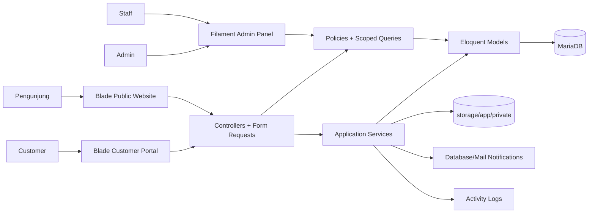
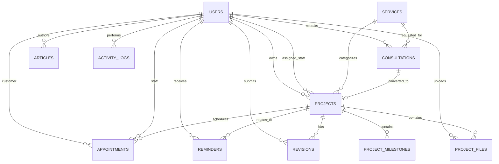

# Tahap 1 — Analisis Project dan Rencana Arsitektur Jokiinlah

**Status:** Final — disetujui sebagai dasar implementasi Tahap 2  
**Tanggal audit:** 22 Juli 2026  
**Revisi arsitektur:** 22 Juli 2026 — keputusan keamanan dan operasional disetujui  
**Lokasi workspace:** `D:\website\jokiinlah`  
**Nama produk sementara:** Jokiinlah  
**Positioning publik:** Pendampingan Akademik & Digital / Academic and Digital Solution

### Ringkasan Revisi Arsitektur

Revisi final Tahap 1 menetapkan UTC sebagai waktu internal dengan konversi Asia/Jakarta, konsultasi awal admin-only beserta alur linking guest yang terverifikasi, file versioning berbasis `document_uuid` dan soft delete eksplisit, archive retention tanpa purge otomatis sebelum Tahap 6, allowed transition project yang teraudit, rencana 2FA admin/staff, Git baseline commit, safety gate MariaDB development, larangan pelanggaran integritas akademik, serta penggunaan logo asli tanpa placeholder.

## 1. Tujuan Dokumen

Dokumen ini menjadi source of truth sebelum implementasi. Isinya mencakup:

- kondisi aktual environment dan project;
- keputusan teknologi dan arsitektur;
- rancangan modul, database, routing, serta authorization;
- strategi file private, audit log, notifikasi, dan keamanan;
- manifest file yang direncanakan;
- urutan implementasi Tahap 2 sampai Tahap 7;
- command, strategi testing, risiko, dan solusi potensial.

Tahap 1 tidak mengimplementasikan fitur bisnis. Tidak ada controller bisnis, model domain, form publik, portal pelanggan, ataupun panel admin yang dibuat pada tahap ini.

## 2. Ringkasan Eksekutif

Project pada awal audit kosong dan bukan repository Git. Ketika perintah untuk melanjutkan sempat dijalankan sebelum scope dikoreksi, Composer menyelesaikan pemasangan **skeleton standar Laravel 12**. Skeleton tersebut dipertahankan karena penghapusan bersifat destruktif dan belum diminta.

Kondisi sekarang:

- Laravel skeleton tersedia dan dapat dijalankan;
- belum ada implementasi domain Jokiinlah;
- belum ada autentikasi tambahan;
- belum ada migration bisnis;
- belum ada UI publik/customer/admin;
- asset logo asli dinyatakan sudah tersedia oleh pemilik project, tetapi belum ditempatkan pada path target saat verifikasi terakhir;
- belum ada perubahan Tahap 2 selain skeleton framework standar.

Arsitektur yang direkomendasikan adalah **modular monolith Laravel**:

- Blade + Tailwind CSS + Alpine.js untuk website publik dan portal customer;
- Laravel Fortify sebagai backend autentikasi ringan dengan Blade view milik aplikasi;
- Filament 5 untuk panel admin/staff;
- MariaDB sebagai database utama;
- private local filesystem untuk dokumen proyek;
- Eloquent Policies sebagai lapisan authorization utama;
- PHPUnit untuk unit dan feature testing.

Pendekatan modular monolith dipilih karena paling sesuai untuk versi pertama: deployment sederhana, transaksi database konsisten, keamanan akses file lebih mudah diaudit, dan tetap dapat dipisah menjadi service lain bila skala produk meningkat.

## 3. Hasil Audit Kondisi Aktual

### 3.1 Environment

| Komponen | Kondisi aktual | Keputusan |
|---|---:|---|
| OS/shell | Windows + PowerShell | Gunakan command Windows-compatible |
| PHP | 8.2.12 | Laravel 12; Laravel 13 memerlukan PHP 8.3+ |
| Composer | 2.10.2 | Memadai |
| Node.js | 24.18.0 | Memadai untuk Vite |
| npm | 11.16.0 | Jalankan melalui `npm.cmd` karena policy PowerShell |
| Laravel | 12.64.0 | Baseline framework |
| MariaDB | 10.4.32 (XAMPP) | Kompatibel; jadikan database aplikasi |
| Apache | 2.4.58 (XAMPP) | Dapat digunakan untuk local deployment |
| PHPUnit | Constraint `^11.5.3` | Testing framework utama |
| Git | CLI tersedia; terdapat folder `.git` kosong/tidak valid | Jalankan `git init` dan baseline commit sebelum perubahan Tahap 2 |

Extension PHP penting yang tersedia: `bcmath`, `curl`, `dom`, `fileinfo`, `gd`, `mbstring`, `mysqli`, `openssl`, `pdo_mysql`, `pdo_sqlite`, `xml`, dan `zip`.

Catatan environment:

- proses Apache dan MariaDB XAMPP aktif;
- MariaDB dapat diakses pada port 3306;
- database bernama `jokiinlah` belum tersedia;
- `upload_max_filesize` dan `post_max_size` masing-masing 40 MB;
- PHP CLI memakai timezone `Europe/Berlin`, tetapi timezone PHP host tidak boleh menjadi sumber kebenaran aplikasi;
- Laravel skeleton masih memakai timezone `UTC`, locale `en`, database `sqlite`, dan `APP_NAME=Laravel`;
- target aplikasi tetap memakai **UTC** untuk proses internal dan penyimpanan, locale `id`, fallback locale `en`, serta MariaDB;
- timezone presentasi adalah `Asia/Jakarta`; seluruh input waktu customer dianggap berada pada timezone ini lalu dikonversi ke UTC sebelum disimpan;
- `intl` belum aktif. Extension ini tidak wajib untuk fondasi saat ini, tetapi direkomendasikan untuk formatting tanggal/angka lintas locale.

### 3.2 Project Laravel

| Area | Kondisi |
|---|---|
| Route | Hanya `GET /` bawaan |
| Model | Hanya `App\Models\User` bawaan |
| Migration | Users/password reset/sessions, cache, dan jobs bawaan |
| Database aktif | SQLite lokal |
| Migration status | Tiga migration bawaan sudah `Ran` pada SQLite |
| View | Hanya `welcome.blade.php` |
| CSS/JS | Entry point Vite standar |
| Dependencies frontend | Belum di-install; `node_modules` tidak ada |
| Authentication | Belum ada login/register/reset/verification UI |
| Admin panel | Belum ada |
| Git | Folder `.git` ada tetapi kosong, sehingga belum merupakan repository Git valid |
| Logo | Logo asli tersedia menurut pemilik project; `public/images/logo.jpeg` belum ditempatkan saat verifikasi terakhir |

### 3.3 File Baseline yang Sudah Ada

Skeleton standar saat ini meliputi:

- `app/Http/Controllers/Controller.php`
- `app/Models/User.php`
- `app/Providers/AppServiceProvider.php`
- `bootstrap/app.php`
- `bootstrap/providers.php`
- `config/*.php`
- `database/factories/UserFactory.php`
- tiga migration bawaan Laravel
- `database/seeders/DatabaseSeeder.php`
- `resources/css/app.css`
- `resources/js/app.js`
- `resources/js/bootstrap.js`
- `resources/views/welcome.blade.php`
- `routes/web.php`
- `routes/console.php`
- test contoh bawaan
- `composer.json`, `composer.lock`, `package.json`, `phpunit.xml`, dan `vite.config.js`

Folder `vendor` tersedia. Folder `node_modules` belum tersedia.

## 4. Keputusan Teknologi

### 4.1 Framework

Gunakan Laravel 12 karena PHP lokal masih 8.2. Laravel 13 tidak dipilih saat ini karena memerlukan PHP 8.3 atau lebih baru. Laravel 12 masih menerima security fix sampai 24 Februari 2027 menurut dokumentasi rilis resminya.

Referensi:

- [Laravel 12 release notes](https://laravel.com/docs/12.x/releases)
- [Laravel 13 release notes](https://laravel.com/docs/13.x/releases)

### 4.2 Autentikasi

Gunakan **Laravel Fortify** sebagai backend autentikasi dan Blade sebagai view autentikasi.

Alasan:

- register, login, logout, forgot/reset password, email verification, dan rate limit dapat ditangani secara Laravel-native;
- tampilan tetap sepenuhnya dapat disesuaikan dengan tema brand;
- lebih ringan daripada SPA starter kit;
- Laravel Breeze tidak menjadi pilihan utama karena tidak lagi menerima pengembangan fitur baru pada generasi Laravel 12.

Fitur autentikasi yang diaktifkan:

- registration customer;
- login/logout;
- password reset;
- email verification;
- update profile/password;
- login throttling;
- session regeneration setelah login;
- nonaktifkan user yang memiliki `is_active=false`.

Two-factor authentication untuk role admin dan staff direncanakan pada Tahap 6. Setelah diaktifkan, 2FA wajib untuk akses panel admin/staff dan recovery code harus diperlakukan sebagai credential sensitif. Customer tidak diwajibkan menggunakan 2FA pada versi awal.

### 4.3 Frontend

- Blade untuk server-rendered UI;
- Tailwind CSS 4 untuk design system;
- Alpine.js untuk menu mobile, modal, accordion, filter ringan, toast, dan loading state;
- Vite untuk bundling;
- Heroicons konsisten sebagai ikon;
- font heading Playfair Display dan body Plus Jakarta Sans/Inter, idealnya self-hosted untuk performa dan privasi.

### 4.4 Admin Panel

Gunakan **Filament 5** pada `/admin`.

Filament 5 kompatibel dengan PHP 8.2+, Laravel 11.28+, dan Tailwind 4.1+. Environment memenuhi PHP/Laravel minimum; constraint Tailwind akan diselaraskan saat instalasi.

Referensi: [Filament 5 installation](https://filamentphp.com/docs/5.x/introduction/installation)

Admin dan staff masuk melalui panel yang sama, tetapi navigation, query, action, dan record access dibatasi berdasarkan role/policy.

### 4.5 Database

Gunakan MariaDB 10.4.32 pada development. Laravel mendukung MariaDB 10.3+.

Prinsip database:

- foreign key eksplisit;
- `restrict` untuk relasi yang tidak boleh hilang secara historis;
- `cascade` untuk child yang tidak bermakna tanpa parent;
- `nullOnDelete` untuk actor/assignee yang dapat dinonaktifkan atau dihapus tanpa menghilangkan histori;
- status disimpan sebagai `string` terindeks dan dicast ke PHP backed enum;
- JSON digunakan untuk list fleksibel seperti features, technologies, dan gallery;
- timestamp disimpan dan diproses dalam UTC;
- output tanggal/waktu untuk pengguna dikonversi ke `Asia/Jakarta` pada presenter/view layer;
- input tanggal/waktu customer diparse secara eksplisit sebagai `Asia/Jakarta`, kemudian dikonversi ke UTC sebelum persist;
- input deadline berbentuk tanggal tanpa jam dinormalisasi menjadi akhir hari (`23:59:59`) Asia/Jakarta sebelum dikonversi ke UTC;
- field tanggal murni yang tidak merepresentasikan suatu waktu (misalnya tanggal publikasi konseptual) dapat tetap menggunakan tipe `date` dan tidak dikenai konversi timezone;
- search/filter menggunakan index komposit sesuai query.

### 4.6 Testing

Gunakan PHPUnit yang sudah menjadi dependensi skeleton. Test database menggunakan SQLite in-memory untuk test generik, ditambah satu pipeline MariaDB untuk memastikan foreign key, JSON, dan index berfungsi pada engine produksi.

## 5. Arsitektur Aplikasi



### 5.1 Layer dan Tanggung Jawab

| Layer | Tanggung jawab |
|---|---|
| Routes | URL, middleware, route model binding, rate limiter |
| Form Requests | Validasi, normalisasi input, authorization awal |
| Controllers | Orkestrasi request-response; tetap tipis |
| Services/Actions | Upload/download, konsultasi ke proyek, kode proyek, activity log |
| Policies | Akses record customer/staff/admin |
| Models | Relationship, cast, scope query, domain helper sederhana |
| Enums | Role/status/category/priority konsisten |
| Notifications | Notifikasi konsultasi, deadline, appointment, dan revisi |
| Filament Resources | CRUD admin/staff dengan policy dan scoped query |
| Blade Components | Design system, form, empty state, badge, timeline, card |

### 5.2 Batas Modul

1. **Public Content** — home, layanan, portofolio, artikel, FAQ, kontak, SEO.
2. **Identity & Access** — auth, role, email verification, profile, panel access, dan rencana 2FA admin/staff.
3. **Consultation** — form publik, request code, attachment private, notification admin; konsultasi awal hanya dikelola admin.
4. **Project Management** — project, milestone, progress, payment status manual.
5. **Secure Files** — private upload/download/versioning/soft delete/retention/audit.
6. **Revision** — request, status, response, attachment, history.
7. **Schedule & Reminder** — appointment, reminder, calendar, notification badge.
8. **Content Management** — service, portfolio, article, testimonial, FAQ, settings.
9. **Audit & Reporting** — activity log, metrics, chart, latest activity.

## 6. Rancangan Database

### 6.1 Diagram Relasi Inti



### 6.2 Tabel Wajib dan Penyempurnaan

#### `users`

Field wajib dipertahankan, ditambah field Laravel standar:

- `email_verified_at`;
- `remember_token`;
- index pada `role`, `is_active`, dan kombinasi role/active;
- role disimpan string dan dicast ke `UserRole`.

#### `services`

- `features` dan `technologies` berupa JSON;
- unique index `slug`;
- index `(category, is_active, sort_order)`.

#### `consultations`

Selain field permintaan, tambahkan:

- `request_code` unique untuk nomor konsultasi;
- metadata lampiran: original name, path, MIME, size;
- `privacy_accepted_at` sebagai bukti persetujuan;
- `source` opsional untuk atribusi;
- index status, service, deadline, created_at.

`user_id` dan `service_id` menggunakan `nullOnDelete` agar histori lead tidak hilang.

Konsultasi awal hanya dapat dikelola oleh admin. Staff tidak dapat melihat, mencari, mengubah, mengunduh lampiran, atau mengonversi konsultasi awal. Tidak ditambahkan `assigned_staff_id` pada `consultations` untuk versi awal. Staff baru memperoleh akses setelah admin mengonversi konsultasi menjadi project dan menetapkan staff tersebut sebagai `projects.assigned_staff_id`.

Tambahkan `archived_at`, `retention_until`, dan `deleted_at` untuk lifecycle serta retensi data konsultasi. Lampiran konsultasi mengikuti lifecycle record induk dan tidak boleh dihapus fisik sebelum memenuhi kebijakan retensi.

Alur konversi konsultasi guest:

1. Admin memeriksa email konsultasi.
2. Bila email tersebut sudah dimiliki akun customer yang terverifikasi, admin dapat menghubungkan `consultations.user_id` ke akun itu setelah memastikan kecocokan.
3. Bila belum ada akun terverifikasi, customer wajib registrasi sendiri menggunakan email yang sama dengan konsultasi dan menyelesaikan verifikasi email.
4. Setelah verifikasi, admin menghubungkan konsultasi ke customer lalu mengonversinya menjadi project.
5. Sistem tidak pernah membuat akun customer otomatis dan tidak pernah menghasilkan password default.

#### `projects`

Tambahan yang dibutuhkan untuk memenuhi flow:

- `consultation_id` nullable untuk traceability konversi;
- `admin_note` nullable;
- `payment_updated_at` nullable sesuai requirement pembayaran manual;
- unique `project_code`;
- progress unsigned 0–100 dengan validasi aplikasi;
- `archived_at`, `retention_until`, dan `deleted_at` untuk lifecycle/retensi;
- index customer/status, staff/status, deadline, service.

Penghapusan customer/service yang telah memiliki proyek dibatasi; user sebaiknya dinonaktifkan, bukan dihapus.

Progress dan status project diatur manual hanya oleh admin atau assigned staff. Milestone berfungsi sebagai timeline kerja dan **tidak** menghitung atau mengubah progress secara otomatis. Setiap perubahan progress/status wajib mencatat actor, nilai sebelum/sesudah, timestamp UTC, IP bila tersedia, dan alasan/catatan pada `activity_logs.metadata`.

#### `project_milestones`

- cascade saat project dihapus;
- index `(project_id, sort_order)` dan `(status, due_date)`.

#### `project_files`

Field utama dipertahankan. `document_uuid` menjadi identitas logis yang stabil untuk satu rangkaian dokumen, sedangkan setiap upload memperoleh nomor `version` baru. `file_name` menyimpan nama asli aman untuk display dan boleh berbeda pada setiap versi; `file_path` menyimpan path UUID yang tidak dapat ditebak. Tambahkan:

- `disk` default `local`;
- `checksum` SHA-256;
- `category` untuk input/hasil/revisi/pendukung;
- uploader menggunakan `nullOnDelete` agar histori tetap ada;
- `document_uuid` UUID terindeks;
- unique index `(project_id, document_uuid, version)`;
- version berikutnya dihitung secara transaksional dengan locking agar upload paralel tidak menghasilkan nomor sama;
- `archived_at`, `retention_until`, dan `deleted_at`;
- model menggunakan `SoftDeletes`.

Customer dan staff tidak memiliki aksi delete file. Mereka hanya dapat mengunggah versi baru; versi sebelumnya tetap tersimpan dan dapat diaudit. Admin dapat melakukan soft delete/restore. Penghapusan permanen file dan record hanya dapat dilakukan admin, harus meminta alasan, harus memenuhi kebijakan retensi kecuali terdapat alasan keamanan/legal yang terdokumentasi, dan wajib dicatat pada activity log sebelum objek fisik dihapus.

Upload file baru pada project membuat `document_uuid` baru dengan version 1. Upload melalui endpoint versi mewarisi `project_id` dan `document_uuid` dari file acuan, lalu membuat record baru; endpoint tidak pernah memperbarui atau menimpa record versi lama.

#### `revisions`

Tambahkan field pendukung form:

- `section_reference` nullable;
- metadata satu lampiran private nullable;
- `archived_at`, `retention_until`, dan `deleted_at` untuk record/lampiran yang relevan;
- index `(project_id, status)`, priority, dan created_at.

Jumlah revisi terpakai dihitung dari relationship agar tidak terjadi data ganda. Tidak dibuat sistem paket/membership.

#### `reminders`

- `reminder_date` disimpan timestamp UTC;
- index `(user_id, is_completed, reminder_date)`;
- project nullable dan `nullOnDelete`.

#### `appointments`

- index customer/date, staff/date, project/status;
- project cascade, staff nullable;
- `meeting_link` hanya ditampilkan kepada pihak berwenang.

#### `portfolios`

- `gallery` dan `technologies` JSON;
- public asset disimpan di public disk, bukan private project disk;
- index published/category/created_at.

#### `articles`

- unique slug;
- author `nullOnDelete` agar artikel tidak hilang;
- index published/category/date;
- reading time dihitung dari content atau disimpan melalui accessor/cache.

#### `testimonials`

- rating 1–5;
- data seeder wajib diberi penanda pada dokumentasi/admin bahwa merupakan data demo.

#### `faqs`

- `service_id` nullable direkomendasikan agar FAQ detail layanan dapat dikelola;
- index active/category/sort.

#### `activity_logs`

- model relation polymorphic melalui `model_type`/`model_id`;
- tambahkan `metadata` JSON dan `user_agent` nullable bila diperlukan audit;
- log bersifat append-only pada UI normal;
- index actor/action/time dan morph columns.

Event minimum yang wajib dicatat meliputi perubahan project status/progress, upload versi file, download, archive, soft delete, restore, permanent delete, perubahan payment status, assignment staff, serta perubahan status revisi.

### 6.3 Tabel Pendukung Tambahan

Tabel berikut diperlukan agar requirement lengkap tanpa memaksakan data ke tabel yang salah:

- `notifications` — database notification Laravel;
- `site_settings` — nama brand, kontak, WhatsApp, email, social links, SEO defaults, dan CTA;
- tabel bawaan `password_reset_tokens`, `sessions`, `cache`, `jobs`, `job_batches`, dan `failed_jobs`.

Tidak dibuat tabel membership, subscription, quotation, invoice, transaction, atau payment gateway.

### 6.4 Urutan Migration

1. users + password reset + sessions;
2. cache/jobs/notifications;
3. services;
4. consultations;
5. projects;
6. project milestones;
7. project files;
8. revisions;
9. reminders;
10. appointments;
11. portfolios;
12. articles;
13. testimonials;
14. FAQs;
15. site settings;
16. activity logs.

Migration yang memiliki lifecycle retention menggunakan `nullable timestamp archived_at`, `nullable timestamp retention_until`, dan Laravel `softDeletes()` (`deleted_at`). Index ditambahkan pada `archived_at`, `retention_until`, dan `deleted_at` sesuai pola query archive/purge.

Model `Consultation`, `Project`, `ProjectFile`, dan `Revision` wajib menggunakan trait `Illuminate\Database\Eloquent\SoftDeletes` secara eksplisit. Query normal mengecualikan record terhapus; akses `withTrashed`, restore, dan force delete hanya tersedia pada workflow admin yang terotorisasi.

### 6.5 Enum Aplikasi

Status disimpan sebagai string di database dan dicast ke enum berikut:

- `UserRole`: admin, staff, customer;
- `ServiceCategory`: academic, data_analysis, web, mobile, desktop, information_system;
- `ConsultationStatus`: new, contacted, reviewed, converted, closed, cancelled;
- `ProjectStatus`: new_request, consultation, waiting_data, requirement_analysis, in_progress, customer_review, revision, completed, cancelled;
- `PaymentStatus`: unpaid, down_payment, paid;
- `MilestoneStatus`: pending, in_progress, completed, cancelled;
- `RevisionPriority`: low, normal, high, urgent;
- `RevisionStatus`: submitted, under_review, in_progress, customer_confirmation, approved, closed;
- `AppointmentStatus`: scheduled, confirmed, completed, cancelled;
- `ArticleCategory`: thesis, research, data_analysis, programming, website, mobile, database, it_career.

Label Indonesia disediakan oleh method enum, sehingga database tetap stabil walaupun copy UI berubah.

### 6.6 Allowed Transition `ProjectStatus`

Transisi normal yang diizinkan:

```text
new_request         -> consultation
consultation        -> waiting_data | requirement_analysis
waiting_data        -> consultation | requirement_analysis
requirement_analysis-> waiting_data | in_progress
in_progress         -> waiting_data | customer_review
customer_review     -> revision | completed
revision            -> in_progress | customer_review
completed           -> tidak memiliki transisi normal
cancelled           -> tidak memiliki transisi normal
```

Perpindahan ke `cancelled` merupakan aksi admin yang wajib menyimpan alasan, bukan transisi staff. Assigned staff hanya dapat mengubah project yang ditugaskan kepadanya dan hanya mengikuti transisi normal di atas. Admin dapat mengikuti transisi normal atau melakukan override ke status lain; setiap override wajib memiliki alasan non-kosong. Semua perubahan mencatat status sebelum/sesudah, jenis transisi normal/override, actor, alasan, dan timestamp UTC melalui `UpdateProjectStatus` serta activity log. No-op transition ditolak.

## 7. Authorization dan Matriks Akses

### 7.1 Prinsip

- middleware role hanya membatasi area besar;
- policy selalu memeriksa record yang diakses;
- query index customer/staff juga di-scope untuk mencegah data leakage;
- admin mendapat akses penuh melalui `Gate::before` atau policy `before`;
- customer tidak pernah mengirim `customer_id`/`uploaded_by` yang dipercaya langsung dari form;
- file selalu mengambil project dari route dan diverifikasi oleh policy.

### 7.2 Matriks Akses Inti

| Aksi | Admin | Staff | Customer | Publik |
|---|:---:|:---:|:---:|:---:|
| Kelola konten publik | Ya | Tidak secara default | Tidak | Baca published |
| Ajukan konsultasi awal | Ya | Tidak | Ya | Ya |
| Lihat/kelola konsultasi awal | Ya | Tidak | Hanya menerima konfirmasi/kode | Tidak |
| Konversi konsultasi menjadi project | Ya | Tidak | Tidak | Tidak |
| Buat project | Ya | Tidak | Tidak | Tidak |
| Lihat project | Semua | Hanya assigned | Hanya milik sendiri | Tidak |
| Ubah status/progress | Ya | Hanya assigned | Tidak | Tidak |
| Upload file project | Ya | Assigned | Owner | Tidak |
| Download file project | Ya | Assigned | Owner | Tidak |
| Upload versi baru file | Ya | Assigned | Owner | Tidak |
| Soft delete/restore file | Ya | Tidak | Tidak | Tidak |
| Hapus permanen file | Ya, wajib alasan dan audit | Tidak | Tidak | Tidak |
| Ajukan revisi | Ya | Tidak sebagai customer | Owner | Tidak |
| Tanggapi revisi | Ya | Assigned | Tidak | Tidak |
| Kelola pembayaran manual | Ya | Tidak | Hanya melihat status | Tidak |
| Lihat activity log | Ya | Terbatas bila dibutuhkan | Tidak | Tidak |

### 7.3 Policy yang Direncanakan

- `UserPolicy`
- `ConsultationPolicy`
- `ProjectPolicy`
- `ProjectMilestonePolicy`
- `ProjectFilePolicy`
- `RevisionPolicy`
- `ReminderPolicy`
- `AppointmentPolicy`
- `ServicePolicy`
- `PortfolioPolicy`
- `ArticlePolicy`
- `TestimonialPolicy`
- `FaqPolicy`
- `SiteSettingPolicy`
- `ActivityLogPolicy`

## 8. Routing Plan

### 8.1 Public

```text
GET  /
GET  /layanan
GET  /layanan/{service:slug}
GET  /portofolio
GET  /portofolio/{portfolio:slug}
GET  /artikel
GET  /artikel/{article:slug}
GET  /faq
GET  /kontak
POST /konsultasi
GET  /sitemap.xml
GET  /kebijakan-privasi
GET  /syarat-dan-ketentuan
```

`POST /konsultasi` menggunakan named rate limiter berbasis IP + email/phone fingerprint.

### 8.2 Authentication

Endpoint login, register, forgot/reset password, email verification, logout, update password, dan profile menggunakan Fortify. Registrasi selalu menghasilkan role `customer`; role admin/staff tidak pernah dapat dipilih dari public form.

### 8.3 Customer Portal

Semua route menggunakan `auth`, `verified`, `active`, dan role customer:

```text
GET    /dashboard
GET    /projects
GET    /projects/{project}
GET    /projects/{project}/files
POST   /projects/{project}/files
GET    /project-files/{projectFile}/download
POST   /project-files/{projectFile}/versions
GET    /projects/{project}/revisions
POST   /projects/{project}/revisions
GET    /reminders
PATCH  /reminders/{reminder}/complete
GET    /appointments
GET    /profile
PATCH  /profile
```

### 8.4 Admin/Staff

Filament menggunakan prefix `/admin`, middleware auth, panel access, policy, dan scoped resource query. Staff dapat masuk panel tetapi hanya melihat project yang ditugaskan beserta milestone/file/revisi/appointment terkait.

## 9. File Storage dan Keamanan Upload

### 9.1 Lokasi

- dokumen konsultasi/project/revisi: `storage/app/private/...` melalui disk `local`;
- asset publik CMS: `storage/app/public/...`;
- logo brand statis sesuai requirement: `public/images/logo.jpeg`.

Laravel 12 menggunakan `storage/app/private` sebagai root default local disk. Referensi: [Laravel filesystem](https://laravel.com/docs/12.x/filesystem).

### 9.2 Flow Upload

1. route wajib authenticated atau public consultation limiter;
2. Form Request memvalidasi extension, MIME, dan ukuran;
3. nama asli dibersihkan hanya untuk display;
4. stored filename menggunakan UUID, tidak memakai nama input;
5. path dibangun server-side berdasarkan project/consultation;
6. metadata dan checksum dicatat;
7. database write dan storage cleanup ditangani aman bila salah satunya gagal;
8. version ditentukan secara transaksional tanpa menimpa versi lama;
9. activity upload dicatat.

Allowlist:

- PDF, DOC, DOCX;
- XLS, XLSX, CSV;
- ZIP, RAR;
- JPG, JPEG, PNG, WEBP.

Executable, script, macro executable yang tidak termasuk allowlist, double extension mencurigakan, MIME mismatch, dan file melebihi limit ditolak.

ZIP dan RAR diperlakukan sebagai **opaque private attachment**: aplikasi tidak boleh mengekstrak, membuka isi, menjalankan, melakukan preview, atau memproses file archive tersebut. Stored filename selalu UUID tanpa extension yang dapat digunakan untuk eksekusi langsung; nama asli hanya metadata display yang telah disanitasi. Validasi wajib mencocokkan extension allowlist, MIME hasil fileinfo, ukuran, dan signature yang dapat dikenali. Archive hanya dapat diunduh sebagai attachment setelah authorization. Pemeriksaan antivirus/asynchronous malware scanning dapat ditambahkan pada Tahap 6, tetapi ketiadaan scanner tidak boleh membuat aplikasi mengekstrak archive.

Limit aplikasi awal direkomendasikan 20 MB per file agar berada di bawah limit server 40 MB. Nilai dibuat configurable melalui environment/site setting.

### 9.3 Flow Download

1. route menerima ID record, bukan raw path;
2. policy memverifikasi admin, assigned staff, atau project owner;
3. controller memastikan path tetap berada pada disk private;
4. response memakai attachment disposition dan nama file aman;
5. download dicatat pada activity log.

Tidak ada URL langsung menuju file private dan tidak ada symlink private ke folder public.

### 9.4 Versioning, Archive, dan Retensi

Lifecycle record/file:

1. **Active** — file dapat dilihat/diunduh sesuai policy dan versi baru dapat diunggah.
2. **Archived** — archived_at terisi; data read-only tetapi masih dapat diakses pihak berwenang.
3. **Retention** — retention_until menentukan tanggal paling awal file boleh dipurge; tanggal ini dapat diperpanjang admin.
4. **Soft deleted** — deleted_at terisi; file disembunyikan dari UI normal tetapi objek fisik tetap private dan dapat direstore admin.
5. **Purged** — record dan objek fisik dihapus permanen hanya oleh admin, dengan reason serta activity log yang dibuat sebelum purge.

Field archived_at, retention_until, dan deleted_at diterapkan minimal pada consultations, projects, project files, serta revisions/lampirannya. Nilai default periode retensi dibuat configurable dan keputusan bisnis final ditetapkan sebelum production. Tidak ada purge otomatis pada Tahap 2–5. Scheduler/command purge otomatis, dry-run, notifikasi pra-purge, dan pengujian restore/purge direncanakan pada Tahap 6. Sistem tidak boleh menghapus data sebelum retention_until, kecuali exceptional security/legal purge yang beralasan dan teraudit.

## 10. UX dan Design System

### 10.1 Token Utama

| Token | Nilai |
|---|---|
| Navy utama | `#0B1933` |
| Navy sekunder | `#162B4D` |
| Rose gold | `#D9A18F` |
| Gold | `#D6A83D` |
| Cream | `#F8F4EE` |
| White | `#FFFFFF` |
| Charcoal | `#202735` |
| Muted text | `#687386` |
| Success | `#198754` |
| Error | `#DC3545` |

Gunakan CSS custom properties sebagai semantic tokens agar public site, customer portal, dan Filament theme konsisten.

### 10.2 Layout

- public: sticky navbar, max-width container, generous whitespace, section rhythm konsisten;
- customer: dark navy sidebar desktop, drawer mobile, cream/white content area;
- admin: Filament theme navy/cream dengan rose gold accent;
- radius 12–20 px dan shadow halus;
- focus ring yang jelas;
- animasi menghormati `prefers-reduced-motion`;
- target sentuh minimum 44×44 px;
- kontras diuji minimal WCAG AA.

### 10.3 Logo dan Asset

Logo asli telah dinyatakan tersedia oleh pemilik project dan akan ditempatkan di `public/images/logo.jpeg`. Pada verifikasi dokumen terakhir file belum berada pada path tersebut. Pada Tahap 3:

- gunakan hanya logo asli setelah ditempatkan pada path target;
- jangan membuat placeholder bila logo asli sudah tersedia;
- verifikasi format file sebenarnya, dimensi, rasio, dan ukuran sebelum digunakan;
- optimalkan dimensinya tanpa mengubah identitas visual dan sediakan alt text;
- siapkan fallback brand mark berbasis teks profesional, tetapi kata “joki” tidak menjadi headline/copy utama.

Tahap 2 tidak mencakup pemrosesan atau desain logo. Tahap 2 hanya menjaga path asset tersebut dan tidak membuat placeholder; integrasi visual logo dilakukan pada Tahap 3.

### 10.4 Ketentuan Integritas Akademik

Halaman syarat dan ketentuan, form konsultasi, dan proses review admin wajib menyatakan bahwa layanan hanya untuk konsultasi, pendampingan, pembelajaran, editing, analisis yang sah, serta pengembangan solusi digital. Layanan harus menolak:

- plagiarisme atau upaya menyamarkan karya pihak lain sebagai karya sendiri;
- fabrikasi, manipulasi, atau pemalsuan data/hasil penelitian;
- pemalsuan penelitian, dokumen, identitas, sitasi, atau bukti akademik;
- pengerjaan ujian, kuis, asesmen terawasi, atau tugas yang wajib dikerjakan mandiri;
- bypass sistem anti-plagiarisme atau mekanisme integritas akademik;
- aktivitas lain yang melanggar kebijakan institusi, hukum, hak kekayaan intelektual, atau integritas akademik.

Customer wajib menyatakan bahwa ia memiliki hak untuk menggunakan data/dokumen yang diunggah dan bertanggung jawab atas penggunaan output. Admin berhak menolak/menutup permintaan yang melanggar ketentuan, mencatat alasan internal, dan menangani file terkait sesuai kebijakan retensi serta hukum yang berlaku. Copy publik harus menekankan pendampingan dan peningkatan pemahaman, bukan jaminan nilai, kelulusan, atau publikasi.

## 11. SEO dan Kinerja

- title/description per halaman melalui Blade slots;
- canonical URL;
- Open Graph/Twitter metadata;
- JSON-LD `Organization`, `Service`, `Article`, dan breadcrumb bila relevan;
- sitemap hanya berisi content published;
- semantic heading satu H1 per halaman;
- image width/height, lazy loading, WebP bila sesuai;
- pagination untuk artikel/portofolio/admin table;
- eager loading dan `withCount` pada dashboard;
- cache query public yang jarang berubah, di-invalidasi saat admin mengubah content;
- jangan cache response yang mengandung data customer;
- production menjalankan config/route/view cache.

## 12. Manifest File yang Direncanakan

Nama migration akan memakai timestamp aktual saat dibuat. Daftar ini adalah rencana, bukan file yang sudah diimplementasikan.

### 12.1 Konfigurasi dan Bootstrap

**Diubah:**

- `.env.example`
- `composer.json`
- `package.json`
- `vite.config.js`
- `bootstrap/app.php`
- `bootstrap/providers.php`
- `config/app.php`
- `config/auth.php`
- `config/filesystems.php`
- `config/fortify.php`
- `config/jokiinlah.php` untuk display timezone, limit upload, dan default retention;
- `config/services.php`
- `routes/web.php`
- `routes/console.php`

**Dibuat:**

- `app/Providers/FortifyServiceProvider.php`
- `app/Providers/Filament/AdminPanelProvider.php`
- `app/Http/Middleware/EnsureUserIsActive.php`
- `app/Http/Middleware/EnsureUserHasRole.php`

### 12.2 Enums

- `app/Enums/UserRole.php`
- `app/Enums/ServiceCategory.php`
- `app/Enums/ConsultationStatus.php`
- `app/Enums/ProjectStatus.php`
- `app/Enums/PaymentStatus.php`
- `app/Enums/MilestoneStatus.php`
- `app/Enums/RevisionPriority.php`
- `app/Enums/RevisionStatus.php`
- `app/Enums/AppointmentStatus.php`
- `app/Enums/ArticleCategory.php`

### 12.3 Models

- `app/Models/User.php`
- `app/Models/Service.php`
- `app/Models/Consultation.php`
- `app/Models/Project.php`
- `app/Models/ProjectMilestone.php`
- `app/Models/ProjectFile.php`
- `app/Models/Revision.php`
- `app/Models/Reminder.php`
- `app/Models/Appointment.php`
- `app/Models/Portfolio.php`
- `app/Models/Article.php`
- `app/Models/Testimonial.php`
- `app/Models/Faq.php`
- `app/Models/SiteSetting.php`
- `app/Models/ActivityLog.php`

### 12.4 Migrations

- modify/create users, password reset, sessions;
- create cache/jobs tables (baseline sudah ada);
- create notifications table;
- create services table;
- create consultations table;
- create projects table;
- create project milestones table;
- create project files table;
- create revisions table;
- create reminders table;
- create appointments table;
- create portfolios table;
- create articles table;
- create testimonials table;
- create FAQs table;
- create site settings table;
- create activity logs table.

Migration 2FA admin/staff direncanakan pada Tahap 6 dan menambahkan secret/recovery codes terenkripsi sesuai mekanisme Fortify yang dipilih. Entitas consultation, project, project file, dan revision harus memasukkan field lifecycle retention yang telah ditetapkan pada bagian 6.

### 12.5 Factories dan Seeders

**Factories:** factory untuk seluruh model domain yang membutuhkan dummy/test data, minimal User, Service, Consultation, Project, ProjectMilestone, ProjectFile, Revision, Reminder, Appointment, Portfolio, Article, Testimonial, dan FAQ.

**Seeders:**

- `database/seeders/DatabaseSeeder.php`
- `database/seeders/UserSeeder.php`
- `database/seeders/ServiceSeeder.php`
- `database/seeders/ConsultationSeeder.php`
- `database/seeders/ProjectSeeder.php`
- `database/seeders/PortfolioSeeder.php`
- `database/seeders/ArticleSeeder.php`
- `database/seeders/TestimonialSeeder.php`
- `database/seeders/FaqSeeder.php`
- `database/seeders/SiteSettingSeeder.php`

Seeder wajib idempotent untuk akun demo menggunakan `updateOrCreate` dan hanya menghasilkan data demo yang realistis.

### 12.6 Controllers

**Public:**

- `app/Http/Controllers/Public/HomeController.php`
- `app/Http/Controllers/Public/ServiceController.php`
- `app/Http/Controllers/Public/PortfolioController.php`
- `app/Http/Controllers/Public/ArticleController.php`
- `app/Http/Controllers/Public/FaqController.php`
- `app/Http/Controllers/Public/ContactController.php`
- `app/Http/Controllers/Public/ConsultationController.php`
- `app/Http/Controllers/Public/SitemapController.php`

**Customer:**

- `app/Http/Controllers/Customer/DashboardController.php`
- `app/Http/Controllers/Customer/ProjectController.php`
- `app/Http/Controllers/Customer/ProjectFileController.php`
- `app/Http/Controllers/Customer/RevisionController.php`
- `app/Http/Controllers/Customer/ReminderController.php`
- `app/Http/Controllers/Customer/AppointmentController.php`
- `app/Http/Controllers/Customer/ProfileController.php`

### 12.7 Form Requests

- `StoreConsultationRequest`
- `StoreProjectFileRequest`
- `StoreRevisionRequest`
- `UpdateReminderRequest`
- `UpdateProfileRequest`
- request admin khusus bila validasi Filament resource tidak mencukupi.

### 12.8 Services/Actions/Notifications

- `app/Services/ActivityLogger.php`
- `app/Services/PrivateFileService.php`
- `app/Actions/Consultations/CreateConsultation.php`
- `app/Actions/Consultations/ConvertConsultationToProject.php`
- `app/Actions/Projects/GenerateProjectCode.php`
- `app/Actions/Projects/UploadProjectFile.php`
- `app/Actions/Projects/UploadNewProjectFileVersion.php`
- `app/Actions/Projects/UpdateProjectProgress.php`
- `app/Actions/Projects/UpdateProjectStatus.php`
- `app/Actions/Files/ArchiveProjectFile.php`
- `app/Actions/Files/PurgeProjectFile.php`
- `app/Notifications/NewConsultationNotification.php`
- `app/Notifications/RevisionSubmittedNotification.php`
- `app/Notifications/AppointmentScheduledNotification.php`
- `app/Notifications/DeadlineReminderNotification.php`

### 12.9 Filament Admin

Resource directories direncanakan untuk:

- Customer/User;
- Staff;
- Consultation;
- Project;
- ProjectMilestone;
- ProjectFile;
- Revision;
- Reminder;
- Appointment;
- Service;
- Portfolio;
- Article;
- Testimonial;
- FAQ;
- SiteSetting;
- ActivityLog.

Setiap resource berada di `app/Filament/Resources/<ResourceName>/` dan memiliki schema/table/page sesuai kebutuhan. Page standar meliputi List, Create, Edit, dan View hanya bila aksi tersebut diizinkan.

Widget:

- `app/Filament/Widgets/AdminStatsOverview.php`
- `app/Filament/Widgets/ProjectsByStatusChart.php`
- `app/Filament/Widgets/PopularServicesChart.php`
- `app/Filament/Widgets/UpcomingDeadlines.php`
- `app/Filament/Widgets/LatestActivities.php`

### 12.10 Blade Layout dan Components

**Layouts:**

- `resources/views/layouts/public.blade.php`
- `resources/views/layouts/customer.blade.php`
- layout auth yang sesuai komponen Laravel.

**Components utama:**

- navbar, footer, logo, SEO head;
- button, input, select, textarea, checkbox, file input;
- form error, alert/toast, modal konfirmasi;
- service card, portfolio card, article card;
- status badge, stat card, progress bar;
- empty state, pagination wrapper, timeline;
- WhatsApp link/button.

**Public views:** home, services index/show, portfolios index/show, articles index/show, FAQ, contact, privacy, terms.

**Auth views:** login, register, forgot password, reset password, verify email, confirm password.

**Customer views:** dashboard, projects index/show/files/revisions, reminders, appointments, profile/settings.

### 12.11 Assets

- `resources/css/app.css`
- `resources/js/app.js`
- `resources/js/bootstrap.js`
- `public/images/logo.jpeg` menggunakan logo asli yang disediakan; tidak membuat placeholder;
- placeholder/thumbnail portofolio dan OG image yang dioptimalkan.

### 12.12 Tests

**Feature:**

- public page and published content tests;
- consultation submission/validation/rate limit tests;
- auth registration/login/reset/verification tests;
- role middleware tests;
- project isolation tests;
- staff assignment scope tests;
- consultation admin-only access tests;
- guest consultation linking hanya ke akun customer terverifikasi dan larangan auto-account tests;
- UTC storage dan Asia/Jakarta input/output conversion tests;
- private file upload/download, `document_uuid` versioning, soft-delete, retention, dan endpoint version authorization tests;
- ZIP/RAR strict validation dan no-extraction behavior tests;
- project progress/status manual update dan activity audit tests;
- revision tests;
- reminder/appointment tests;
- Filament resource access tests;
- admin dashboard/widget query tests.

**Unit:**

- enum labels dan allowed/override ProjectStatus transitions;
- model relationships/casts/scopes;
- project/request code generation;
- file name sanitization and MIME allowlist;
- WhatsApp message builder;
- reading time calculation.

## 13. Tahapan Implementasi yang Disetujui

### Prasyarat Sebelum Perubahan Tahap 2

1. Pastikan dokumen Tahap 1 final dan logo asli siap ditempatkan.
2. Perbaiki/inisialisasi repository Git dengan `git init` karena folder `.git` saat ini kosong/tidak valid.
3. Review file yang akan masuk commit dan pastikan `.env`, database SQLite, log, cache, serta credential tidak ter-commit.
4. Buat baseline commit yang memuat skeleton Laravel dan dokumentasi Tahap 1.
5. Buat database MariaDB khusus development `jokiinlah_dev`.
6. Ubah `.env` ke MariaDB development, `APP_ENV=local`, internal timezone UTC, dan display timezone Asia/Jakarta.
7. Jalankan `config:clear`, lalu verifikasi environment dan nama database aktual.
8. Hanya setelah verifikasi eksplisit menunjukkan `local` dan `jokiinlah_dev`, migration destructive boleh dijalankan.

### Tahap 2 — Domain dan Authentication

- konfigurasi locale, UTC internal, Asia/Jakarta presentation/input, dan MariaDB;
- instalasi Fortify;
- enums, migrations, models, relationships;
- middleware role/active dan policies dasar;
- factories dan seeders;
- akun demo;
- migration fresh/seed dan test domain/auth.

### Tahap 3 — Public Website

- design tokens/layout/navbar/footer;
- landing page lengkap;
- layanan, portofolio, artikel, FAQ, kontak;
- consultation form dan admin notification;
- SEO dasar dan responsiveness.

### Tahap 4 — Customer Portal

- dashboard;
- project detail/progress/milestone;
- private files;
- revision;
- reminder/appointment;
- profile dan WhatsApp project message.

### Tahap 5 — Admin/Staff Panel

- instalasi/theme Filament;
- resources dan relation managers;
- dashboard widgets;
- staff scoping;
- content management dan manual payment status.

### Tahap 6 — Hardening dan Polish

- activity log menyeluruh;
- wajibkan two-factor authentication untuk admin dan staff;
- implementasikan command/scheduler retensi dan purge otomatis dengan dry-run serta audit;
- tambahkan malware scanning asynchronous bila infrastructure tersedia;
- notification, empty/loading/error states;
- cache public content;
- SEO lengkap;
- accessibility/responsive audit;
- security review.

### Tahap 7 — Verification dan Dokumentasi Akhir

- full test suite;
- MariaDB fresh seed;
- route/policy matrix checks;
- file security tests;
- browser/console/responsive test;
- README, installation, demo accounts, deployment, production checklist.

## 14. Command Tahap 1

Command audit yang telah dijalankan:

```powershell
Get-ChildItem -Force
rg --files -g '!vendor' -g '!node_modules'
php -v
php -m
composer --version
composer diagnose
node --version
npm.cmd --version
php artisan about --only=environment,drivers
php artisan --version
php artisan route:list --except-vendor
php artisan migrate:status
Test-Path public\images\logo.jpeg
Test-Path node_modules
Test-Path .git
```

Command observasi MariaDB:

```powershell
& 'C:\xampp\mysql\bin\mysql.exe' --version
& 'C:\xampp\mysql\bin\mysql.exe' -u root -e "SELECT VERSION(), @@port, @@character_set_server, @@collation_server; SHOW DATABASES;"
```

Catatan: command query di atas hanya untuk development lokal. Credential production tidak boleh ditulis ke source code atau dokumentasi.

## 15. Command yang Direncanakan untuk Tahap 2

Command berikut **belum dijalankan sebagai implementasi Tahap 2** dan harus dieksekusi hanya setelah persetujuan melanjutkan:

### 15.1 Inisialisasi Git dan Baseline Commit

```powershell
git init
git branch -M main
git status --short
git check-ignore .env
git add .
git status --short
git commit -m 'chore: establish Laravel 12 architecture baseline'
```

Sebelum commit, hasil git check-ignore harus menunjukkan bahwa file .env diabaikan. Review git status dan pastikan credential, database lokal, log, cache, serta file upload tidak berada dalam staged files. Baseline commit harus selesai sebelum dependency atau kode Tahap 2 diubah.

### 15.2 Membuat Database MariaDB Development

```powershell
& 'C:\xampp\mysql\bin\mysql.exe' -u root --execute='CREATE DATABASE IF NOT EXISTS jokiinlah_dev CHARACTER SET utf8mb4 COLLATE utf8mb4_unicode_ci;'
& 'C:\xampp\mysql\bin\mysql.exe' -u root --execute='SHOW DATABASES LIKE ''jokiinlah_dev'';'
```

Command tersebut khusus environment XAMPP lokal yang telah diaudit. Baseline development pada mesin ini menggunakan konfigurasi XAMPP terverifikasi: user `root` lokal tanpa password dan hanya untuk workstation development. Untuk environment bersama, buat user development khusus dengan privilege hanya ke `jokiinlah_dev` dan masukkan credential aktual secara lokal ke `.env`; jangan menaruh credential tersebut di dokumentasi, `.env.example`, atau source code. Credential production tidak boleh digunakan pada workflow ini.

### 15.3 Konfigurasi `.env`

```dotenv
APP_NAME=Jokiinlah
APP_ENV=local
APP_DEBUG=true
APP_URL=http://localhost:8000
APP_LOCALE=id
APP_FALLBACK_LOCALE=en
APP_TIMEZONE=UTC
DISPLAY_TIMEZONE=Asia/Jakarta

DB_CONNECTION=mysql
DB_HOST=127.0.0.1
DB_PORT=3306
DB_DATABASE=jokiinlah_dev
DB_USERNAME=root
DB_PASSWORD=
```

`APP_TIMEZONE=UTC` menjadi timezone proses internal. `DISPLAY_TIMEZONE=Asia/Jakarta` dibaca dari config aplikasi khusus untuk parse input customer dan format output. Nilai credential nyata hanya berada dalam `.env`, sedangkan `.env.example` memakai placeholder aman.

### 15.4 Clear Config dan Safety Verification

```powershell
php artisan config:clear
php artisan about --only=environment,drivers
php artisan db:show --database=mysql
php artisan config:show app
```

Hentikan proses bila hasil tidak menunjukkan seluruh nilai berikut:

- environment: `local`;
- database: `jokiinlah_dev` melalui koneksi MariaDB/MySQL;
- internal timezone: `UTC`;
- display timezone: `Asia/Jakarta`.

Jangan menjalankan `migrate:fresh` pada database yang namanya tidak persis `jokiinlah_dev`. Command tersebut menghapus seluruh tabel pada koneksi aktif.

### 15.5 Dependency, Migration, dan Verifikasi Tahap 2

Pada implementasi Tahap 2, buat `config/jokiinlah.php` terlebih dahulu. Jangan menjalankan `config:show jokiinlah` sebelum file itu tersedia. Setelah file dibuat, jalankan urutan berikut:

```powershell
composer require laravel/fortify
php artisan fortify:install
npm.cmd install
php artisan make:notifications-table
php artisan config:clear
php artisan config:show jokiinlah
php artisan about --only=environment,drivers
php artisan db:show --database=mysql
php artisan migrate:fresh --seed
php artisan test
npm.cmd run build
php artisan route:list
```

## 16. Strategi Testing

### 16.1 Tahap 1

Verifikasi Tahap 1 dianggap lolos bila:

- versi runtime tercatat;
- struktur existing tercatat;
- route/model/migration existing tercatat;
- logo dan Git status diketahui;
- database engine dan limit upload diketahui;
- keputusan stack memiliki alasan kompatibilitas;
- seluruh modul, relasi, route, policy, dan manifest file sudah dipetakan;
- gap requirement sudah diidentifikasi;
- tidak ada fitur bisnis yang diimplementasikan.

### 16.2 Tahap 2–7

Piramida testing:

1. unit test untuk enum, helper, scope, dan service murni;
2. feature test untuk HTTP, validation, auth, policy, dan database;
3. integration test MariaDB untuk migration dan constraint;
4. browser smoke test untuk responsive UI, upload, download, dan console;
5. manual security checklist untuk IDOR, private file, role escalation, dan XSS.

Coverage diprioritaskan pada authorization dan file handling, bukan sekadar persentase global.

## 17. Risiko, Potensi Error, dan Solusi

| Risiko/error | Penyebab | Mitigasi/solusi |
|---|---|---|
| `npm.ps1 cannot be loaded` | PowerShell execution policy | Gunakan `npm.cmd`/`npx.cmd`; tidak perlu mengubah policy global |
| Composer gagal koneksi | Network sandbox/proxy/firewall | Jalankan dengan izin network yang sesuai, cek proxy/CA, ulangi `composer diagnose` |
| Laravel 13 tidak dapat dipasang | PHP hanya 8.2 | Tetap Laravel 12 atau upgrade PHP ke 8.3+ secara terencana |
| Timezone deadline bergeser | Host timezone berbeda dari customer WIB | Internal/config app tetap UTC; parse input sebagai Asia/Jakarta lalu konversi ke UTC; format output kembali ke Asia/Jakarta |
| Upload ditolak server sebelum Laravel | Limit PHP/Apache lebih kecil | App limit 20 MB, server limit 40 MB; sinkronkan `post_max_size` |
| File dapat ditebak/diakses langsung | Nama asli/path public | UUID stored name, private disk, policy-protected controller |
| IDOR project/file | Hanya cek user sudah login | Route model + policy + scoped query + negative authorization tests |
| Staff melihat project lain | Resource query Filament tidak di-scope | Override query dan tetap gunakan policy per record |
| Staff melihat konsultasi awal | Resource/menu/query konsultasi terbuka untuk staff | Consultation policy dan Filament resource admin-only; tidak ada assigned staff pada consultation |
| Customer mendaftarkan role admin | Role diterima dari request | Role registration selalu ditetapkan server-side sebagai customer |
| Cascade menghapus histori | FK deletion rule terlalu agresif | Restrict parent penting; soft/nonaktifkan user; null actor opsional |
| Native database enum sulit diubah | Status berkembang | String column + PHP backed enum + validation |
| Seeder demo tampil sebagai testimoni asli | Tidak ada penanda | Dokumentasi dan badge admin “data demo”; wajib diganti sebelum production |
| Slug collision | Judul sama | Unique slug generator dengan suffix |
| Double submit konsultasi | Klik ulang/retry | Loading state, rate limit, idempotency fingerprint opsional |
| Progress/status tidak sinkron | Update bebas | Validasi transition di action/service, audit log setiap perubahan |
| Milestone mengubah progress tanpa persetujuan | Progress dihitung otomatis | Milestone hanya timeline; progress 0–100 selalu diubah manual admin/assigned staff |
| Versi file tertimpa atau dihapus customer | Identitas dokumen bergantung nama file atau version digunakan ulang | document_uuid stabil, unique project/document/version, UUID path, locking transaksional, tanpa customer/staff delete action, SoftDeletes |
| Akun guest dibuat tidak aman | Konversi konsultasi membuat akun/password default | Customer registrasi dan verifikasi sendiri; admin hanya linking ke email terverifikasi; tidak ada auto-account |
| ZIP/RAR berbahaya atau zip bomb | Archive diekstrak/diproses | Simpan opaque private attachment; jangan extract/preview/execute; validasi extension, MIME, signature, dan ukuran |
| Purge sebelum masa retensi | Scheduler/action tidak memeriksa retention | Gate pada retention_until, admin-only, reason wajib, audit sebelum purge; otomatisasi ditunda Tahap 6 |
| Akun panel diambil alih | Admin/staff hanya memakai password | Wajibkan 2FA admin/staff pada Tahap 6 dan lindungi recovery codes |
| migrate:fresh mengenai database salah | Config cache atau .env menunjuk database lain | config:clear, db:show, config:show, dan verifikasi nama persis jokiinlah_dev sebelum eksekusi |
| MariaDB tidak ada di PATH | XAMPP binary tidak didaftarkan | Gunakan path eksplisit atau tambahkan XAMPP bin ke user PATH |
| Public storage symlink bermasalah di Windows | Permission symbolic link | Gunakan `php artisan storage:link` dengan privilege tepat atau serving strategy deploy |
| Query dashboard lambat | N+1/agregasi berulang | Eager load, `withCount`, index, cache agregat publik/admin yang aman |
| XSS dari artikel rich text | HTML disimpan dan dirender mentah | Sanitasi allowlist server-side; Blade escaping default |
| Credential bocor | `.env` ter-commit | `.env` tetap ignored; `.env.example` hanya placeholder |

## 18. Asumsi dan Keputusan yang Masih Membutuhkan Data

Implementasi dapat dimulai dengan default aman, tetapi data berikut perlu diberikan sebelum production:

- penempatan logo asli yang telah tersedia ke `public/images/logo.jpeg` serta verifikasi dimensinya;
- nomor WhatsApp tujuan;
- email admin/notifikasi;
- alamat/area operasional bila ditampilkan;
- tautan media sosial;
- isi kebijakan privasi dan syarat ketentuan yang telah direview;
- batas ukuran file final;
- SMTP/transactional mail provider;
- kredensial database production;
- domain dan Open Graph image final.

Untuk development, seluruh nilai tersebut harus menggunakan dummy/configuration placeholder, bukan credential hard-coded.

## 19. Definition of Done Tahap 1

- [x] Struktur project diperiksa.
- [x] Routes existing diperiksa.
- [x] Model existing diperiksa.
- [x] Migration dan statusnya diperiksa.
- [x] Config/runtime/dependency diperiksa.
- [x] Database engine lokal diperiksa.
- [x] Logo asli dikonfirmasi tersedia; path target diperiksa dan masih menunggu penempatan file.
- [x] Gap requirement diidentifikasi.
- [x] Arsitektur modular monolith ditetapkan.
- [x] Stack autentikasi/admin/frontend/testing ditetapkan.
- [x] Relasi database dan deletion policy dirancang.
- [x] Matriks role/authorization dirancang.
- [x] Strategi private storage dirancang.
- [x] UTC internal dan konversi input/output Asia/Jakarta ditetapkan.
- [x] Konsultasi awal ditetapkan admin-only tanpa assigned staff.
- [x] Versioning, soft delete, archive, retention, dan admin-only purge dirancang.
- [x] ZIP/RAR ditetapkan sebagai opaque private attachment tanpa extraction/execution.
- [x] Progress manual serta milestone timeline-only ditetapkan.
- [x] Rencana 2FA admin/staff ditempatkan pada Tahap 6.
- [x] Git baseline commit ditetapkan sebagai prasyarat Tahap 2.
- [x] Runbook MariaDB development dan safety gate migrate:fresh disusun.
- [x] Ketentuan integritas akademik ditambahkan.
- [x] Aturan penggunaan logo asli tanpa placeholder ditetapkan.
- [x] Verifikasi config khusus dipindahkan setelah `config/jokiinlah.php` tersedia.
- [x] Credential placeholder dihapus dan baseline memakai XAMPP development yang terverifikasi.
- [x] Versioning memakai `document_uuid`, unique index logis, endpoint, dan action khusus.
- [x] Alur linking konsultasi guest ke akun terverifikasi ditetapkan tanpa auto-account.
- [x] Trait `SoftDeletes` diwajibkan eksplisit pada empat model lifecycle.
- [x] Allowed transition ProjectStatus dan admin override teraudit ditetapkan.
- [x] Scope logo ditegaskan berada di Tahap 3, tanpa placeholder pada Tahap 2.
- [x] Routing plan dirancang.
- [x] Manifest file Tahap 2–7 disusun.
- [x] Testing strategy disusun.
- [x] Risiko dan solusi disusun.
- [x] Command audit dan command lanjutan didokumentasikan.
- [x] Tidak ada fitur bisnis Tahap 2 yang diimplementasikan.
- [x] Tahap 1 dinyatakan final dan siap menjadi baseline implementasi Tahap 2.

## 20. Output Tahap 1

1. **Penjelasan perubahan:** audit lengkap, dokumen arsitektur, dan revisi keputusan keamanan/operasional diselesaikan.
2. **File dibuat:** `docs/TAHAP-1-ANALISIS-DAN-ARSITEKTUR.md`.
3. **File aplikasi diubah:** tidak ada oleh pekerjaan dokumentasi Tahap 1.
4. **Kode lengkap file:** seluruh isi dokumen ini adalah output lengkap; belum ada kode bisnis pada Tahap 1.
5. **Command:** tercantum pada bagian 14 dan 15.
6. **Testing:** tercantum pada bagian 16.
7. **Potensi error dan solusi:** tercantum pada bagian 17.

---

**Peringatan akun demo untuk tahap berikutnya:** akun `admin@example.com`, `staff@example.com`, dan `customer@example.com` dengan password `password` hanya boleh digunakan pada local/staging. Password wajib diganti dan seeder demo tidak boleh dijalankan pada production tanpa guard eksplisit.
